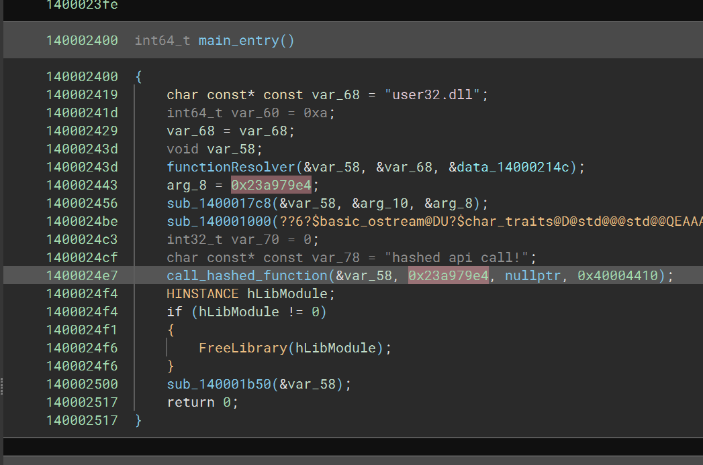
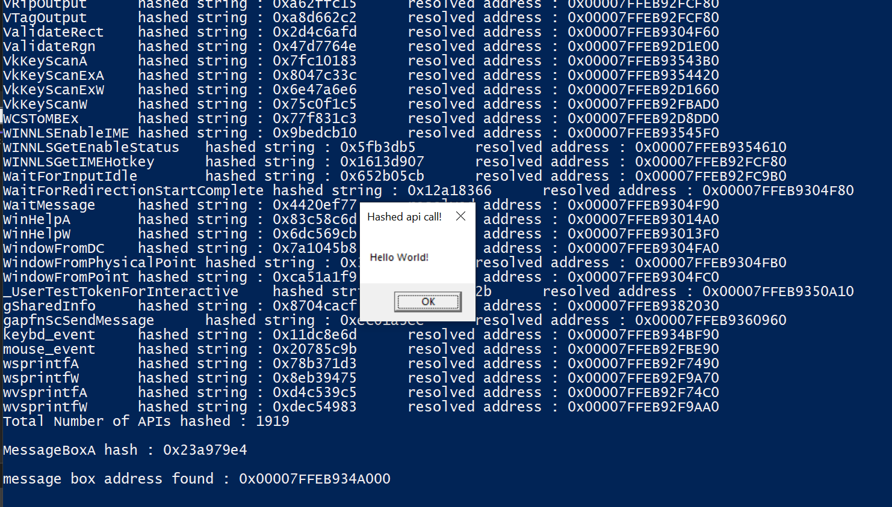
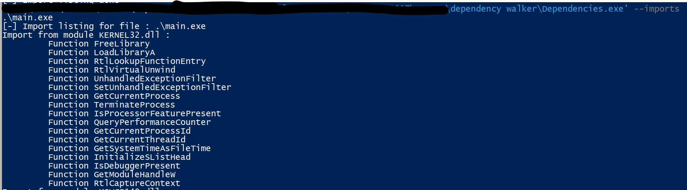
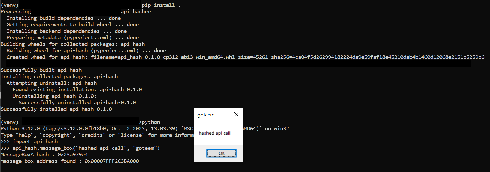

# api_hasher

to quickly be able to test out hashing algorithms for win32 api resolution
See examples for usage.

## Installation
Requires cmake 3.28 and msvc 2022 17.1 due to C++ 20 modules.
hashing algorithms are exported in hash_function module.

## Usage
```cpp
import api_hash;
import hash_functions;

#include <Windows.h>
#include <compare>
#include <iostream>

int main() {
    // decide which hash function we want to use
    constexpr auto hf = hash_functions::fnva1;

    // compile time hash function no string stored
    // fnva1 MessageBoxA == 0x23a979e4
    constexpr auto msgboxhash = hf("MessageBoxA");

    // init api hash object
    auto fh = functionResolver{"user32.dll", hf};

    // perform lookup for hash 0x23a979e4
    auto mbox_address = fh.resolve_function_hash(msgboxhash);
    std::cout << "\nMessageBoxA hash : 0x" << std::hex << msgboxhash
              << " found at address : " << mbox_address << '\n';
    
    // convenience method to wrap a function pointer
    // templated to function signature <return type, params...>
    // messageboxa would  be equivilant to
    // functionResolver::call_hashed_function<int, HWND, LPCSTR, LPCSTR, UINT>(mbox_address);
    fh.call_hashed_function<int>(msgboxhash, nullptr, "hello world", "hashed api call!", MB_OK);
    return 0;
}
```

We can see the compile time string function in binja decomp.



Debug statements



No MessageBoxA import from example



Python bindings for message box



