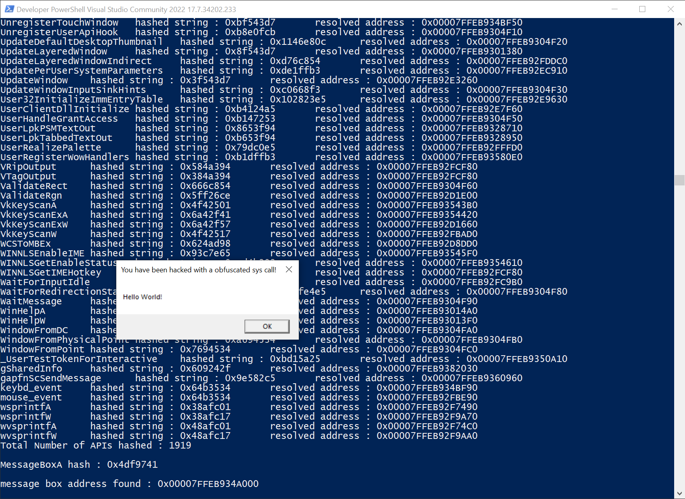

# api_hasher

Designed to quickly be able to easlily a hashing algorithm for win32 api resolution
See examples for usage.

## Installation
Requires cmake 3.28 and msvc 2022 17.1 due to C++ 20 modules.
hashing algorithms are exported in hash_function module.

## Usage
```cpp
import api_hash;
import hash_functions;

#include <compare>
#include <Windows.h>
#include <functional>
#include <iostream>

using custom_message_box = std::function<int(HWND hWnd, LPCSTR lpText, LPCSTR lpCaption, UINT uType)>;
using msgbox_sig = int(*)(HWND, LPCSTR, LPCSTR, UINT);

int main() {
	// decide which hash function we want to use
	constexpr auto hf = hash_functions::fnva1;
	constexpr auto msgboxhash = hf("MessageBoxA");
	auto fh = functionResolver{ "user32.dll", hf};
	auto mbox_address = fh.resolve_function_hash(msgboxhash);
	std::cout << "\nMessageBoxA hash : 0x" << std::hex << msgboxhash << '\n';
	if (not mbox_address) {
		std::cout << "\nmessage box address not found\n";
		return 0;
	}
	std::cout << "\nmessage box address found : 0x" << std::hex << mbox_address << '\n';

	custom_message_box cmboxa = reinterpret_cast<msgbox_sig>(mbox_address);
	cmboxa(nullptr, "Hello World!", "Hashed api call!", MB_OK);
	return 0;
}
```

Debug statements



No MessageBoxA import from example


